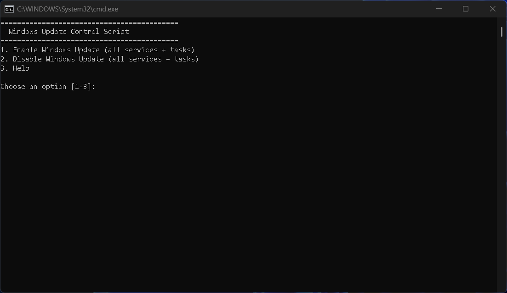
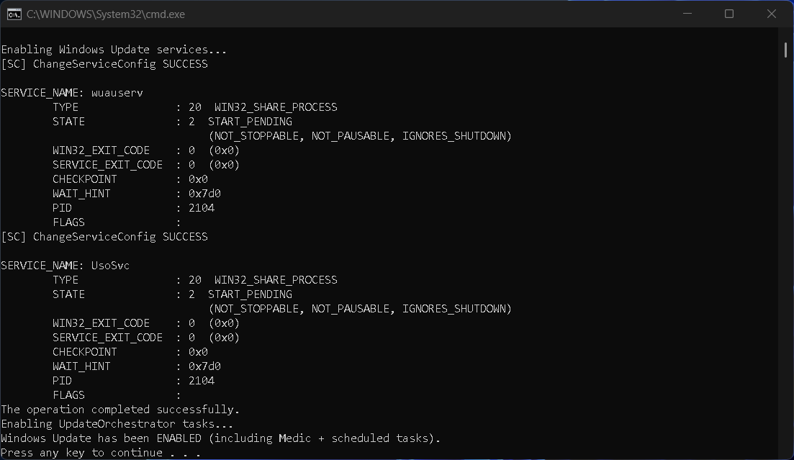
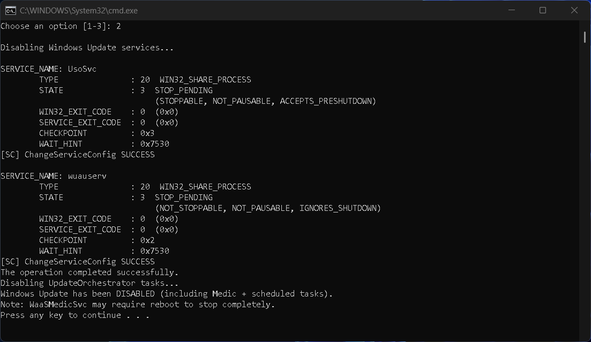
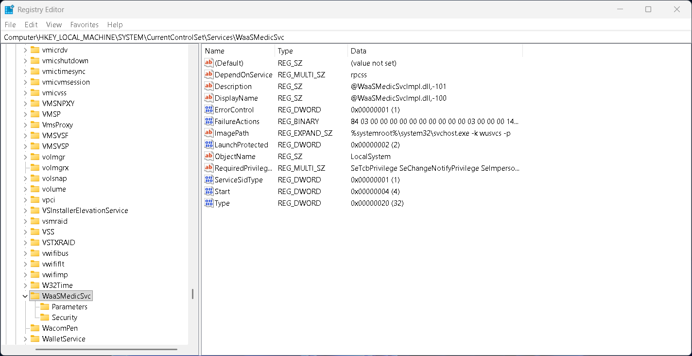
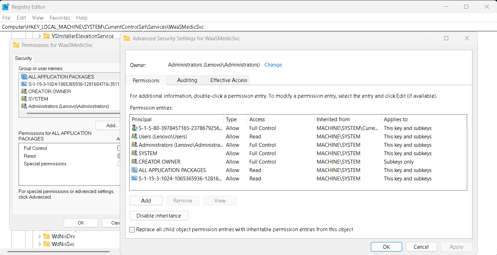
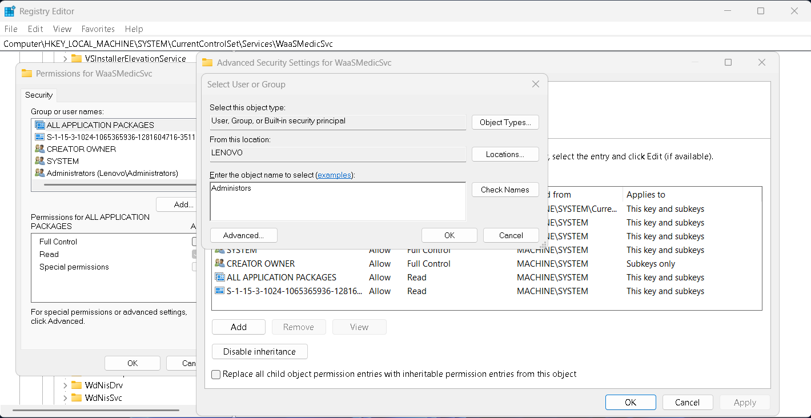

---

Windows Update Enable/Disable Script

A simple one-click batch script to enable or disable Windows Update services, including Update Orchestrator and Windows Update Medic, along with associated scheduled tasks. Designed for Windows 10/11 to prevent background CPU/disk/network usage, forced restarts, and unwanted updates.

---

Features

Enable/Disable Windows Update (wuauserv)

Enable/Disable Update Orchestrator Service (UsoSvc)

Enable/Disable Windows Update Medic Service (WaaSMedicSvc)

Automatically handles UpdateOrchestrator scheduled tasks:

Schedule Scan

USO_UxBroker

Reboot

UpdateModel

Kills Medic process immediately on disable

Menu-driven interface with help and safety notes

---

Screenshots

Script Menu

This is the main menu when you run the script:
### Script Menu

Enable Mode

When enabling Windows Update, the services and tasks are restored:
### Enable Mode

Disable Mode

When disabling Windows Update, the script stops services, disables tasks, and kills Medic:
### Disable Mode

Registry Permissions for WaaSMedicSvc

Before the script can fully disable Medic, you must take ownership and grant Full Control.

---

Usage

1. Download the script:
windows_update_enable_disable_script.bat

2. Run as Administrator
Right-click → Run as Administrator (required for service control and task scheduler changes).

3. Choose an option from the menu:

1. Enable Windows Update (services + tasks)

2. Disable Windows Update (services + tasks)

3. Help

4. Invalid input exits the script automatically.

---

Important: Registry Permissions for WaaSMedicSvc

Before the script can fully disable Windows Update Medic Service, you must take ownership of its registry key once:

1. Open Registry Editor (Win + R → regedit).

2. Navigate to:

HKEY_LOCAL_MACHINE\SYSTEM\CurrentControlSet\Services\WaaSMedicSvc
### Registry - Screenshot Reference

3. Right-click the WaaSMedicSvc key → Permissions → Advanced.
### Registry Permissions - Advanced Tab

4.Change Owner from TrustedInstaller to your Administrators account.
### Registry Permissions - Owner Change

6. Check Replace owner on subcontainers and objects → Apply.

7. Grant your admin account Full Control → Apply → OK.

After this one-time setup, the script can toggle Medic on/off automatically.

---

How It Works

Enable:

Sets wuauserv and UsoSvc to Manual start and starts them

Sets WaaSMedicSvc to Manual (Start=3)

Enables UpdateOrchestrator scheduled tasks

Disable:

Stops and disables wuauserv and UsoSvc

Sets WaaSMedicSvc Disabled (Start=4) and kills the running process

Disables UpdateOrchestrator scheduled tasks

---

Notes

Must run as Administrator.

A reboot may be required for Medic to stop completely.

Always re-enable Windows Update periodically to install security patches.

Works on Windows 10/11.

---

License

MIT License — feel free to use, modify, and share.

---
